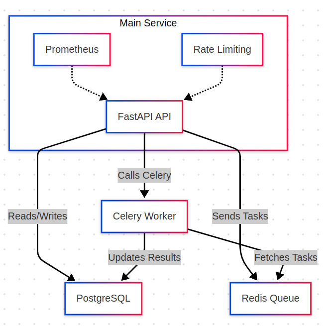
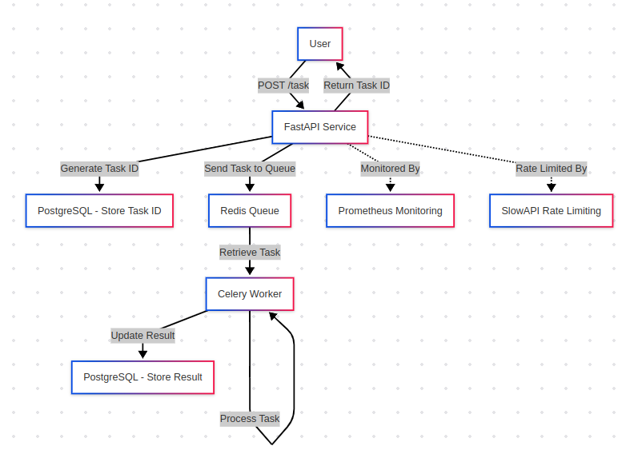
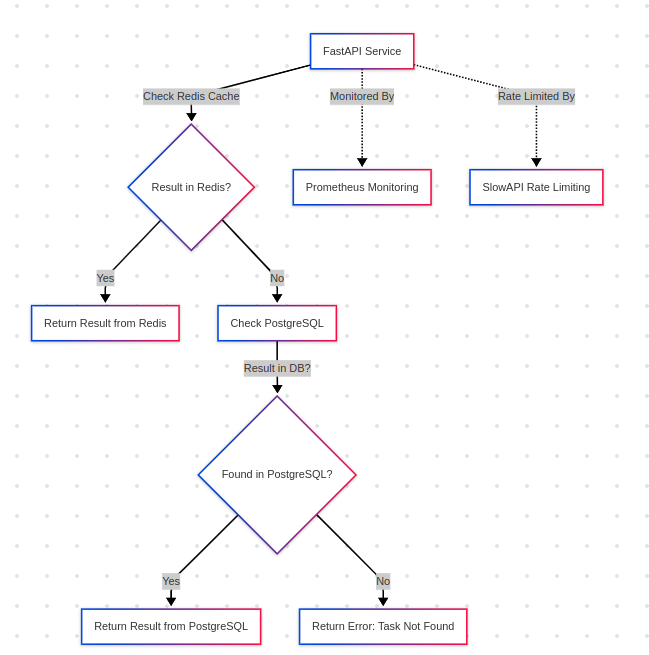

Here's a comprehensive README.md for your Content Moderation API project:

## Workflow Diagram


# Content Moderation API

A high-performance content moderation API leveraging OpenAI's moderation models, built with FastAPI, Celery, and PostgreSQL. Designed for asynchronous processing and horizontal scaling.

## Features

- 🚀 Asynchronous task processing with Celery and Redis
- 🔒 Rate limiting for API endpoints
- 📊 Built-in Prometheus monitoring and metrics
- 🐳 Dockerized deployment with compose
- 📈 Database migrations with Alembic
- 🧪 Health checks for all dependencies
- 📝 Request logging and error tracking

## Technologies

- **API Framework**: FastAPI
- **Task Queue**: Celery + Redis
- **Database**: PostgreSQL
- **Monitoring**: Prometheus
- **ORM**: SQLAlchemy 2.0
- **Containerization**: Docker + Docker Compose

## Getting Started

### Prerequisites

- Docker 20.10+
- Docker Compose 2.0+
- Python 3.10+ (for local development)
- OpenAI API Key

### Installation
1. Clone the repository:
   ```bash
   git clone https://github.com/krithick-j/content-moderation.git
   cd krithick-j-content-moderation
   ```

2. Create `.env` file from template:
   ```bash
   cp envexample.txt .env
   ```
   Update the values in `.env` with your credentials.

3. Build and start services:
   ```bash
   docker compose up 
   ```
    Make sure the ports are available

4. Verify containers are running:
   ```bash
   docker ps
   ```

## Environment Variables

| Variable | Description | Example |
|----------|-------------|---------|
| `POSTGRES_DB` | PostgreSQL database name | `moderation_db` |
| `POSTGRES_USER` | Database user | `postgres` |
| `POSTGRES_PASSWORD` | Database password | `secret` |
| `REDIS_URL` | Redis connection URL | `redis://redis:6379/0` |
| `OPENAI_API_KEY` | OpenAI API key | `sk-...` |
| `MODERATION_MODEL` | OpenAI moderation model | `text-moderation-latest` |

## API Documentation

### Endpoints

**POST** `/api/v1/moderate/text`
```json
{
  "text": "Sample text to moderate"
}
```

**GET** `/api/v1/moderate/result/{task_id}`
```json
{"task_id":"bc73f551-c87f-4613-baf9-bea1f36f1f47","result":{"id":"modr-404c2452f1ffb7fd2a958d7f46c9e4fe","model":"omni-moderation-latest","results":[{"categories":{"harassment":false,"harassment/threatening":false,"hate":false,"hate/threatening":false,"illicit":false,"illicit/violent":false,"self-harm":false,"self-harm/instructions":false,"self-harm/intent":false,"sexual":false,"sexual/minors":false,"violence":false,"violence/graphic":false},"category_applied_input_types":{"harassment":["text"],"harassment/threatening":["text"],"hate":["text"],"hate/threatening":["text"],"illicit":["text"],"illicit/violent":["text"],"self-harm":["text"],"self-harm/instructions":["text"],"self-harm/intent":["text"],"sexual":["text"],"sexual/minors":["text"],"violence":["text"],"violence/graphic":["text"]},"category_scores":{"harassment":5.391084403253366e-06,"harassment/threatening":6.748051590048605e-07,"hate":1.4738981974494932e-06,"hate/threatening":8.851569304133282e-08,"illicit":5.738759521437678e-06,"illicit/violent":2.627477314480822e-06,"self-harm":1.8058518261159955e-06,"self-harm/instructions":5.955139348629957e-07,"self-harm/intent":1.1478768127080353e-06,"sexual":8.481104172358076e-06,"sexual/minors":7.889262586245034e-07,"violence":1.0071400221737608e-05,"violence/graphic":8.664653147910923e-07},"flagged":false}]},"status":"SUCCESS"}
```

### Monitoring Endpoints

- `/metrics`: Prometheus metrics endpoint
- `/health`: System health check (DB, Redis, Celery)

## Workflow Diagram

### POST API Flow


### GET API Flow


## Development

### Running Migrations
```bash
alembic upgrade head
```

### Logging
Logs are stored in:
```
/app/logs/
  ├── app_YYYY-MM-DD.log
  └── app_error_YYYY-MM-DD.log
```

## Troubleshooting

Common issues:
1. **Database Connection Failures**:
   - Verify `.env` credentials
   - Check PostgreSQL logs: `docker compose logs db`

2. **Celery Task Queue Backlog**:
   - Scale workers: `docker compose up --scale celery_worker=4`

3. **Rate Limit Errors**:
   - Adjust rate limits in `app/api/moderation.py`

## License

MIT License - see [LICENSE](LICENSE) for details.
